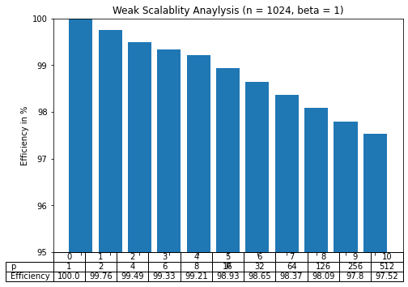
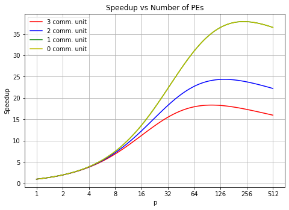

# Project 1 Report

## Question 1
Testing was done on aIntel(R) Core(TM) i9-10900K CPU @ 3.70GHz, 3696 Mhz, 10 Core(s), 20 Logical Processor(s) running Windows 10


The results from testing the are as follows:

|Vector size|14,000,000|16,000,000|16,700,000|16,777,216|17,000,000
|----|----|----|----|----|----
Seq dot result|1.4e+07|1.6e+07|1.67e+07|1.67772e+07 |1.67772e+07|					
Thread dot result|1.4e+07|1.6e+07|1.67e+07|1.67772e+07 | 1.7e+07|						
Seq runtime (s)	|0.01333336|0.0235163|0.016238|0.0160632|0.0163746s|					
Thread runtime (s)|0.0080387|0.0125971|0.0097339|0.0097385|0.0096551s|	

The Thread dot result is accurate for two vectors of size 17,000,000, but the sequential dot result is not accurate for two vectors of size larger than 16,777,216 (for example, 17,000,000). 

This is because 32-bit floats (according to IEEE-754) are stored in the following format: `sign (1 bit) + exponent(8 bits) + mantissa (23 bits)`. The mantissa is where the value is stored and 16,777,216 is exactly 2^24 so any number more precice (like 16,777,217) cannot be stored in a 32-bit float. This obviously causes a calculation issue and is the reason any number higher results in the same answer of 16,777,216 because it cannot increment. The thread dot does not have this issues because it calculates using partial sums and never needs the full precision of a float32.

## Question 2

### 2.1
Provided Code is slightly modified to run all test cases in a loop.


```python
import numpy as np

sizes = [14000000,16000000,16700000,16777216,17000000]

def dot (v1, v2):

    result = np.float32(0)
    for i in range(len(v1)):
        result += v1[i] * v2[i]
    print(f'Results for {len(v1)}: {result}\n')
    return result

for size in sizes:
    # Test the dot product function
    v1 = np.ones(size, dtype = np.float32)
    v2 = np.ones(size, dtype = np.float32)

    %time dot(v1, v2)
```

### Python Dot Product Results

|Vector size|14,000,000|16,000,000|16,700,000|16,777,216|17,000,000
|----|----|----|----|----|----
Python dot result|14000000|16000000|16700000|16777216|16777216|										
Python runtime (s)	|2.65|3.01|3.13|3.21|3.31|						

### 2.2
Using NumPy libraries


```python
def numpyDot (v1, v2):
    result = np.float32(0)
    # for i in range(len(v1)):
    result = np.sum(np.multiply(v1,v2))
    print(f'Results for {len(v1)}: {result}\n')
    return result

for size in sizes:
    # Test the dot product function
    v1 = np.ones(size, dtype = np.float32)
    v2 = np.ones(size, dtype = np.float32)

    %time numpyDot(v1, v2)
```

|Vector size|14,000,000|16,000,000|16,700,000|16,777,216|17,000,000
|----|----|----|----|----|----
NumPy dot result|14000000|16000000|16700000|16777216|17000000|										
NumPy runtime (s)	|0.0412|0.0441|0.063.5|0.061|0.0427|		


Notably, this method produces correct result for float32 vectors of size 17,000,000 because the NumPy library function `sum` utilizes pairwise summation. The memory fetched into the cache for the index i will be directly reused for calculation with index i+1, which will be used for i +2 and so on. This works because the arrays are stored in contiguous memory in row major form. This navigates around the prceision issue of float32's mentioned in problem #1. 

### 2.3
Overall Results and Comparison 1, 2.1, 2.2


Combined Table:
|Vector size|14,000,000|16,000,000|16,700,000|16,777,216|17,000,000
|----|----|----|----|----|----
Python runtime (s)	|2.65|3.01|3.13|3.21|3.31|	
NumPy runtime (s)	|0.0412|0.0441|0.063.5|0.061|0.0427|
Seq runtime (s)	|0.01333336|0.0235163|0.016238|0.0160632|0.0163746s|				
Thread runtime (s)|0.0080387|0.0125971|0.0097339|0.0097385|0.0096551s|
Python dot result|14000000|16000000|16700000|16777216|16777216|										
NumPy dot result|14000000|16000000|16700000|16777216|17000000|										
Seq dot result|14000000|16000000|16700000|16777216 |16777216|					
Thread dot result|14000000|16000000|16700000|16777216 |17000000|	

As seen in the table, nothing can beat C/C++ code, as it simply is too efficient and fast. Even NumPy's optimizations still are slower than the sequential C++ code. The Multi-threaded C++ code ran much much faster than any other langauage/algorithm combination. While the increase from base python to NumPy saw a huge increase in speed (nearly 64 times as fast), the increase from sequential C++ to threaded to C++ was faster but by a less wide margin (only about 1.65 times faster). Much like the issue with the sequential C++ dot product, a sequential python dot product also caps out at a maximum of 16777216 before answers are no longer accurate.

## Question 3


See code in p3.ipynb



## Question 4

See code in p4.ipynb


